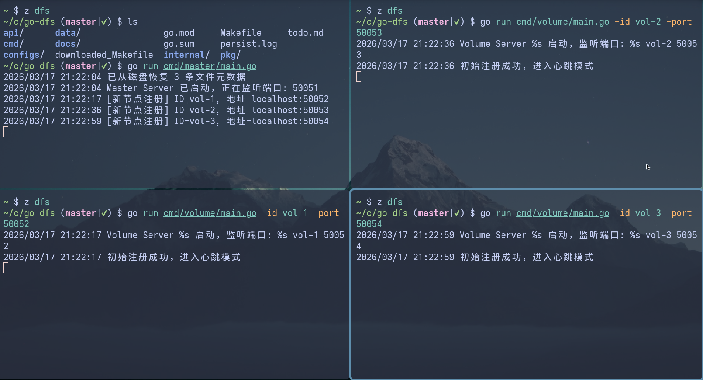

# 从零开始的分布式文件系统（go-dfs）

一个用 Go 实现的简化分布式文件系统实验项目，重点放在 `Master / Volume` 分离、流式上传下载、链式复制、一致性哈希和基础工程化，而不是追求生产可用性。

---

## English Version

See [README_EN.md](README_EN.md)。当前以中文文档为准，英文版本可能滞后。

## 项目定位

`go-dfs` 当前处于 `v1` 收口阶段，目标是成为一个可运行、可测试、可演示、可讲清楚的作品项目。

这个仓库适合用来学习和展示以下主题：

- gRPC + Protobuf 的服务拆分
- `Master` 元数据管理与 `Volume` 数据存储分离
- 一致性哈希与副本分配
- 链式复制的数据写入路径
- Go 并发、测试和基础工程结构

它目前不是生产级文件系统，也不宣称具备完整容灾、自动恢复或高可用能力。

---

## 当前状态

### 已实现

- `Master` 节点
  - `Volume` 节点注册与心跳维护
  - 基于一致性哈希的文件副本分配
  - 文件名到副本地址的元数据管理
  - 元数据的本地 JSON 持久化

- `Volume` 节点
  - 流式文件上传
  - 流式文件下载
  - 链式复制转发
  - 本地文件落盘

- `Client` 工具
  - 向 `Master` 请求写入位置
  - 向 `Volume` 发起上传和下载

- 基础工程能力
  - 一致性哈希实现与单元测试
  - gRPC 连接池实现与单元测试
  - `Master` / `Volume` 服务层单元测试
  - `make build` / `make test` 等构建入口

### 当前可演示

- 本地启动 `1 Master + 3 Volume`
- 上传文件并完成链式复制写入
- 从 `Master` 获取文件位置并下载文件
- 当节点心跳超时后，`Master` 将其从可用节点列表中剔除

### 当前未实现或暂不宣称

- `Master` 高可用或共识协议（如 `Raft`）
- 节点失效后的自动副本修复
- 节点增减后的自动数据迁移 / 再均衡
- 严格定义的 `Quorum` 一致性语义
- 认证、鉴权、监控指标、生产部署方案
- 自动化端到端集成测试

---

## 架构概览

```text
+-------------------+        +-------------------+        +-------------------+
|      Client       |        |      Master       |        |      Volume       |
|                   |        |                   |        |                   |
| - Upload file     | <----> | - Register nodes  | <----> | - Store file      |
| - Download file   |        | - Assign replicas |        | - Forward chunks  |
|                   |        | - Track metadata  |        | - Serve download  |
+-------------------+        +-------------------+        +-------------------+
                                    |    |    |
                                    v    v    v
                              +-------------------+
                              |   Volume Nodes    |
                              |   (Replicas)      |
                              +-------------------+
```

### 上传路径

1. `Volume` 启动后向 `Master` 注册，并周期性发送心跳。
2. `Client` 上传文件时，先调用 `AssignVolume` 请求副本链路。
3. `Master` 返回按一致性哈希挑选出的多个 `Volume` 地址。
4. `Client` 向第一个 `Volume` 发起流式上传。
5. 第一个 `Volume` 本地写盘，并将元数据和数据块继续转发给下游节点。

### 下载路径

1. `Client` 先调用 `GetFileLocation` 获取文件所在节点。
2. `Master` 返回一个可读取的 `Volume` 地址。
3. `Client` 直接从该 `Volume` 进行流式下载。

---

## 最小运行方式

### 环境要求

- Go `1.21+`
- `protoc`（仅在重新生成 protobuf 代码时需要）

### 构建

```bash
make build
```

### 启动本地集群

推荐直接使用仓库内置脚本，而不是手工开多个终端。

1. 启动本地集群

```bash
make cluster-start
```

这条命令会：

- 重建当前二进制
- 启动 `1 Master + 3 Volume`
- 将日志写入 `runtime/local-cluster/logs/`
- 将运行时数据写入 `runtime/local-cluster/data/`

2. 停止本地集群

```bash
make cluster-stop
```

3. 清理运行时目录

```bash
make cluster-clean
```

4. 运行最小 smoke test

```bash
make smoke-test
```

5. 运行失败路径验证：节点不足时上传失败

```bash
make smoke-test-insufficient-nodes
```

### 底层手工命令

如果需要逐个组件排查，也可以手工启动。

1. 启动 `Master`

```bash
./bin/master -port=50051
```

说明：默认将元数据持久化到当前目录下的 `persist.log`。

2. 启动 3 个 `Volume`

```bash
./bin/volume -id=vol-1 -port=50052 -master=localhost:50051
./bin/volume -id=vol-2 -port=50053 -master=localhost:50051
./bin/volume -id=vol-3 -port=50054 -master=localhost:50051
```

说明：每个 `Volume` 默认将文件写入 `./data/<node-id>/`。

3. 上传文件

```bash
./bin/client -action=upload -file=test.txt -path=./test.txt -master=localhost:50051
```

4. 下载文件

```bash
./bin/client -action=download -file=test.txt -path=./downloaded_test.txt -master=localhost:50051
```

---

## 当前验证方式

当前仓库已经纳入的基础验证主要是单元测试和构建检查：

```bash
go test ./...
make build
make smoke-test
```

现阶段这些验证可以证明：

- 核心服务逻辑可编译且单元测试通过
- `Master` 的节点注册、分配、心跳剔除等基本行为受测试覆盖
- `Volume` 的上传、下载、本地文件处理等基本行为受测试覆盖
- 本地多节点 happy path 可以通过 smoke test 验证

现阶段这些验证还不能证明：

- 多进程本地集群在所有故障场景下都稳定
- 故障场景下副本数据可以自动修复
- 该系统适合生产环境使用

---

## 项目结构

```text
go-dfs/
├── api/                    # Protobuf 与 gRPC 接口定义
├── cmd/                    # 可执行程序入口
│   ├── master/             # Master 节点入口
│   ├── volume/             # Volume 节点入口
│   └── client/             # 客户端入口
├── internal/
│   ├── hash/               # 一致性哈希
│   ├── pool/               # gRPC 连接池
│   ├── service/            # Master / Volume 核心逻辑
│   └── bench/              # Benchmark 实验代码
├── configs/                # 配置文件
├── docs/                   # 技术文档与实验记录
├── Makefile
└── README.md
```

---

## 技术文档

- [go-dfs v1 边界说明](docs/project/2026-03-26-go-dfs-v1-boundary.md)
- [单元测试指南](docs/testing-guide.md)
- [一致性哈希原理](docs/consistent-hashing.md)
- [连接池设计与实现](docs/connection-pool.md)
- [性能测试指南](docs/benchmark-guide.md)
- [性能优化实战](docs/performance-optimization.md)

说明：性能相关文档目前更适合作为本地实验记录和优化笔记，不应直接视为生产级性能承诺。

---

## 已知限制

- `Master` 仍然是单点，没有高可用
- 元数据只做本地持久化，没有复制
- 读取路径目前只返回一个地址，不包含读副本选择策略
- 节点失效后只会剔除，不会自动补副本
- 当前 smoke test 只覆盖 happy path 和一个有限的失败路径，不覆盖完整故障注入

---

## 运行截图



---

## 参考资源

- [The Google File System](https://static.googleusercontent.com/media/research.google.com/en//archive/gfs-sosp2003.pdf)
- [HDFS Architecture Guide](https://hadoop.apache.org/docs/stable/hadoop-project-dist/hadoop-hdfs/HdfsDesign.html)
- [Ceph Architecture](https://docs.ceph.com/en/latest/architecture/)

---

## 许可证

MIT License
